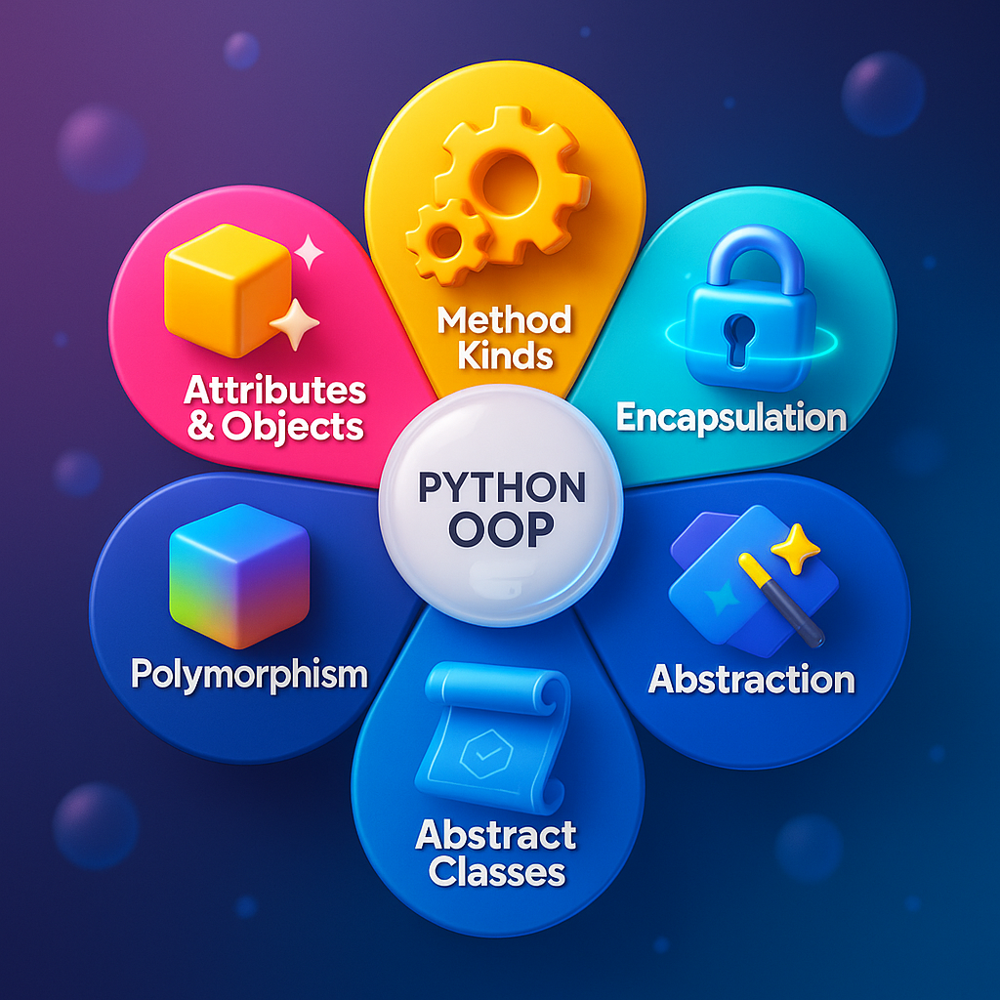

# OOP : From chaos to clarity. From beginner to builder.

#### 📁 Section 4: Object-Oriented Programming for CV
*Videos 20-29*

</a>
</a>

| Video | Title                                                                      |  |
| ----- | -------------------------------------------------------------------------- | ------------------------------------------------- |
| 20    | 🚪 What is OOP? Why It Matters for Computer Vision                         |
| 21    | 📦 Classes vs Functions – When to Use Which                                |
| 22    | 🛠️ Defining Your First Class: `ImageProcessor`                            |
| 23    | 🧱 Attributes & Methods – Organizing Image Transformations                 |
| 24    | 🗝️ Constructors (`__init__`) and Default Settings                         |
| 25    | 🔁 Inheritance – Build Specialized Processors from Base Classes            |
| 26    | 🎯 Mini Project: Build an Image Processor with Load–Transform–Save Methods |
| 27    | 🧙 Magic Methods (Dunder) – Customize Behavior with `__str__`, `__add__`, `__eq__`, etc. |                                     |
| 28    | 🎁 Data Classes – Say Goodbye to Boilerplate with `@dataclass`             |
| 29    | 🧭 Class vs Static vs Instance Methods – When and Why to Use Each          |

#### 📁 Section 4A: Advanced Pythonic OOP
*Videos 30-36*

| Video | Title                                                                      ||
| ----- | -------------------------------------------------------------------------- | ------------------------------------------------- |
| 30    | 🔐 Encapsulation & Property Decorators – Clean Access with `@property` and Getters/Setters |                                   |
| 31    | 🌀 Polymorphism – Use One Interface with Many Implementations              |
| 32    | 🧱 Abstract Base Classes – Enforce Rules Using `abc.ABC` and `@abstractmethod` |                                               |
| 33    | 🧰 Composition Over Inheritance – "Has-a" Relationships for Real-World Modeling |                                              |
| 34    | 💼 Build a Professional-Grade `ImagePipeline` Class                        |
| 35    | 🔄 OOP Design Patterns for Computer Vision Applications                    |
| 36    | 📝 Mini Project: Complete OOP-Based Image Processing Library               |
