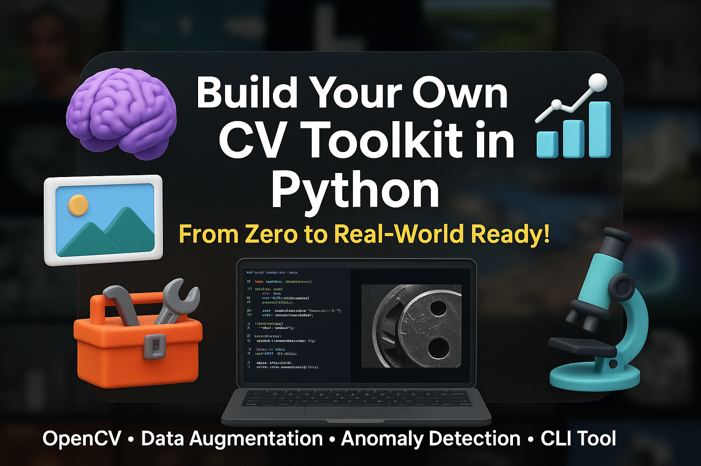

# 🧠 Python for Computer Vision: Build Your Own Image Toolkit from Scratch

</a>

A hands-on course where you'll learn how to **build your own image processing toolkit in Python**, tailored for **real-world computer vision tasks**. From loading images to simulating defects and preparing datasets for deep learning — this course gives you the tools to do it all (and ship your own CLI tool at the end!).

## ✅ What You'll Learn

#### 🔍 Python & Computer Vision Fundamentals
#### 📁 Dataset Management & Organization
#### 🖼️ Image Preprocessing & Manipulation
#### 🧮 Essential CV Algorithms
#### 🔄 Advanced Computer Vision Techniques
#### 🎭 Data Augmentation & Simulation
#### 📊 Analysis & Validation
#### ⚡ Performance Optimization
#### 🔧 Tools & Integration

## 🚀 By the End, You'll Have:
A fully working `cv_toolkit.py` script that lets you run commands like:
```bash
python cv_toolkit.py --input ./raw --resize 256x256 --grayscale --add_scratches --output ./processed
```

## 💡 Perfect For:
- 🔍 Aspiring computer vision engineers
- 🤖 AI/ML developers who struggle with image prep
- 🛠️ Python devs looking to break into CV
- 💡 Anyone building personal or production-level vision projects

---

## 📚 Table of Contents

<details open>
<summary><strong>Expand All Sections</strong></summary>

- [🧠 Python for Computer Vision: Build Your Own Image Toolkit from Scratch](#-python-for-computer-vision-build-your-own-image-toolkit-from-scratch)
  - [✅ What You'll Learn](#-what-youll-learn)
      - [🔍 Python \& Computer Vision Fundamentals](#-python--computer-vision-fundamentals)
      - [📁 Dataset Management \& Organization](#-dataset-management--organization)
      - [🖼️ Image Preprocessing \& Manipulation](#️-image-preprocessing--manipulation)
      - [🧮 Essential CV Algorithms](#-essential-cv-algorithms)
      - [🔄 Advanced Computer Vision Techniques](#-advanced-computer-vision-techniques)
      - [🎭 Data Augmentation \& Simulation](#-data-augmentation--simulation)
      - [📊 Analysis \& Validation](#-analysis--validation)
      - [⚡ Performance Optimization](#-performance-optimization)
      - [🔧 Tools \& Integration](#-tools--integration)
  - [🚀 By the End, You'll Have:](#-by-the-end-youll-have)
  - [💡 Perfect For:](#-perfect-for)
  - [📚 Table of Contents](#-table-of-contents)
  - [📁 Section 1: Introduction Series (Videos 1–7)](#-section-1-introduction-series-videos-17)
  - [📁 Section 2: Core Python Basics for CV (Videos 8–14)](#-section-2-core-python-basics-for-cv-videos-814)
  - [📁 Section 3: Object-Oriented Programming (OOP) in Computer Vision (Videos 15–21)](#-section-3-object-oriented-programming-oop-in-computer-vision-videos-1521)
  - [📁 Section 4: Working with Images in Python (Videos 22–27)](#-section-4-working-with-images-in-python-videos-2227)
  - [📁 Section 5: File \& Folder Management (Videos 28–34)](#-section-5-file--folder-management-videos-2834)
  - [📁 Section 6: Image Manipulation \& Preprocessing (Videos 35–40)](#-section-6-image-manipulation--preprocessing-videos-3540)
  - [📁 Section 7: Essential CV Algorithms: Edge Detection \& Filtering (Videos 41–47)](#-section-7-essential-cv-algorithms-edge-detection--filtering-videos-4147)
  - [📁 Section 8: Feature Detection \& Matching (Videos 48–53)](#-section-8-feature-detection--matching-videos-4853)
  - [📁 Section 9: Data Augmentation \& Defect Simulation (Videos 54–59)](#-section-9-data-augmentation--defect-simulation-videos-5459)
  - [📁 Section 10: Advanced Segmentation \& Contour Analysis (Videos 60–65)](#-section-10-advanced-segmentation--contour-analysis-videos-6065)
  - [📁 Section 11: Motion Analysis \& Tracking (Videos 66–70)](#-section-11-motion-analysis--tracking-videos-6670)
  - [📁 Section 12: Mask Generation \& Segmentation Tools (Videos 71–75)](#-section-12-mask-generation--segmentation-tools-videos-7175)
  - [📁 Section 13: Metadata \& Annotation Tools (Videos 76–79)](#-section-13-metadata--annotation-tools-videos-7679)
  - [📁 Section 14: Dataset Analysis \& Statistics (Videos 80–84)](#-section-14-dataset-analysis--statistics-videos-8084)
  - [📁 Section 15: Performance Optimization (Videos 85–89)](#-section-15-performance-optimization-videos-8589)
  - [📁 Section 16: Bridging Traditional CV and Deep Learning (Videos 90–94)](#-section-16-bridging-traditional-cv-and-deep-learning-videos-9094)
  - [📁 Section 17: NEW: Optimizing PaDiM Anomaly Detection (Videos 95–99)](#-section-17-new-optimizing-padim-anomaly-detection-videos-9599)
    - [🧪 Mini Project: Build a PaDiM-Based Defect Detector](#-mini-project-build-a-padim-based-defect-detector)
      - [Example CLI usage:](#example-cli-usage)
      - [📂 File Structure:](#-file-structure)
  - [📁 Section 18: Model Validation \& Testing (Videos 100–103)](#-section-18-model-validation--testing-videos-100103)
  - [📁 Section 19: Final Project – Build a Full CV Toolkit (Videos 99–103)](#-section-19-final-project--build-a-full-cv-toolkit-videos-99103)
    - [🧪 Mini Project: Build Your Own CLI Image Toolkit](#-mini-project-build-your-own-cli-image-toolkit)
  - [📁 Section 20: Bonus Tips \& Next Steps (Videos 104–108)](#-section-20-bonus-tips--next-steps-videos-104108)
  - [✅ Summary](#-summary)

</details>

---

## 📁 Section 1: Introduction Series (Videos 1–7)

This section introduces the course and sets the stage for what's to come. Learners will understand the goals of the course, why computer vision is important, and how Python can be used to solve real-world problems in this field.

| Video | Title                                                                   |
| ----- | ----------------------------------------------------------------------- |
| 1     | 📦 Introduction    [🎥 Watch Video](https://youtu.be/tAumg8Odcm4) | [💻 Code Example](No)     |
| 2     | 📦 What is Computer Vision & Why Python? + Real-World Use Cases    [🎥 Watch Video](https://youtu.be/trL2qIfpY3U) | [💻 Code Example](No)     |
| 3     | 🛠️ Installing Python & Tools You Need – With Common Pitfalls & Fixes [🎥 Watch Video](https://youtu.be/ocVk_B-ivHQ) | [💻 Code Example](No)   |
| 4     | 🎵 Modern Dependency Management with Poetry [🎥 Watch Video](https://youtu.be/F5sdNXb2P98) | [💻 Code Example]("No")|
| 5     | 🔍 Code Quality with Pre-commit Hooks [🎥 Watch Video](https://youtu.be/yLKmW7zjTwM)                                  |
| 6     | 🧪 Running Your First Image Script – "Hello World" for CV               |
| 7     | 🧭 Course Roadmap – How to Get the Most Out of This Playlist            |

---

## 📁 Section 2: Core Python Basics for CV (Videos 8–14)

This section focuses on essential Python concepts required for image processing. It covers variables, loops, functions, and other key basics.


| Video | Title                                                          | Code Example                                      |
| ----- | -------------------------------------------------------------- | ------------------------------------------------- |
| 8     | 🔢 Variables, Numbers & Strings [🎥 Watch Video](https://youtu.be/2cp5OEHMoNQ) | [💻 Code Example](Sec2_Core_Python_CV/Variables_Numbers_Strings_CV.ipynb) |
| 9     | 📋 Lists, Tuples & Dictionaries                                |                                                   |
| 10    | ➡️ If Statements & Loops                                       |                                                   |
| 11    | 🔁 Functions                                                   |                                                   |
| 12    | 🖼️ Reading Input & Displaying Output                           |                                                   |
| 13    | 🏫 Mini Project: Resize Multiple Images with a Function        |                                                   |
| 14    | 🧪 Quiz Time: Test Your Python Knowledge So Far                |                                                   |


---

## 📁 Section 3: Object-Oriented Programming (OOP) in Computer Vision (Videos 15–21)

Learners will explore object-oriented programming principles and how they can be applied to create efficient and reusable code for image processing tasks.

| Video | Title                                                                                       |
| ----- | ------------------------------------------------------------------------------------------- |
| 15    | 🚪 What is OOP? Why It Matters for Computer Vision                                          |
| 16    | 📦 Classes vs Functions – When to Use Which                                                 |
| 17    | 🛠️ Defining Your First Class: `ImageProcessor`                                             |
| 18    | 🧱 Attributes & Methods – Organizing Image Transformations                                  |
| 19    | 🗝️ Constructors (`__init__`) and Default Settings                                          |
| 20    | 🔁 Inheritance – Build Specialized Processors from Base Classes                             |
| 21    | 🎯 Mini Project: Create an `ImageProcessor` class that can load, transform, and save images |

---

## 📁 Section 4: Working with Images in Python (Videos 22–27)

In this section, learners get hands-on experience with image processing tools like OpenCV and Pillow.

| Video | Title                                                                 |
| ----- | --------------------------------------------------------------------- |
| 22    | 📷 How Computers See Images – Pixels, RGB, Channels                   |
| 23    | 📥 Load & Show Images Using OpenCV & Pillow – Side-by-Side Comparison |
| 24    | 📐 Resize, Crop & Rotate – Basic Transformations                      |
| 25    | 🌈 Color Spaces – Convert RGB to Gray, HSV & More                     |
| 26    | 💾 Save Modified Images Back to Disk                                  |
| 27    | 📸 Mini Project: Grayscale Converter for a Folder of Images           |


## 📁 Section 5: File & Folder Management (Videos 28–34)

Learners will focus on organizing and managing large datasets — an essential skill for anyone working with multiple image files. This section covers renaming, moving, converting files in bulk, plus version control for image datasets.

| Video | Title                                                         |
| ----- | ------------------------------------------------------------- |
| 28    | 🗂️ Organizing Your Dataset – Folder Structures for ML/CV     |
| 29    | 📁 List All Images in a Folder Recursively                    |
| 30    | 🔄 Rename, Move & Copy Files Like a Pro                       |
| 31    | ❌ Delete Unwanted Files Safely                               |
| 32    | 🖼️ Convert BMP to PNG in Bulk                                |
| 33    | 🔄 Version Control for Image Datasets – Git LFS & DVC         |
| 34    | 📁 Mini Project: Organize Dataset into Train/Val/Test Folders |

---

## 📁 Section 6: Image Manipulation & Preprocessing (Videos 35–40)

In this section, learners will dive into image preprocessing techniques like cropping, patching, and enhancing contrast — crucial for preparing images for machine learning models.

| Video | Title                                                 |
| ----- | ----------------------------------------------------- |
| 35    | 📦 Patchify Large Images into Tiles                   |
| 36    | ✂️ Crop Images to Region of Interest                  |
| 37    | 🎨 Histogram Equalization for Better Contrast         |
| 38    | 🖌️ Overlay Masks on Images for Segmentation          |
| 39    | 🔀 Normalize Pixel Values for Deep Learning           |
| 40    | 🧰 Mini Project: Crop + Resize + Save Batch of Images |

---

## 📁 Section 7: Essential CV Algorithms: Edge Detection & Filtering (Videos 41–47)

This new section introduces fundamental computer vision algorithms that form the basis of image analysis, starting with edge detection and image filtering techniques.

| Video | Title                                                            |
| ----- | ---------------------------------------------------------------- |
| 41    | 🔍 Introduction to Image Filtering & Kernel Operations           |
| 42    | 🔪 Edge Detection: Sobel, Canny, and Laplacian Operators         |
| 43    | 🧮 Convolution: How Filters Work Under the Hood                  |
| 44    | 🎯 Corner Detection: Harris & Shi-Tomasi Methods                 |
| 45    | 🧿 Blob Detection Using Laplacian of Gaussian                    |
| 46    | 🌀 Advanced Filtering: Bilateral & Non-Local Means for Denoising |
| 47    | 🎭 Mini Project: Create an Edge Detection Visualization Tool     |


## 📁 Section 8: Feature Detection & Matching (Videos 48–53)

This section introduces learners to **keypoint-based feature detection and matching**, essential techniques in many real-world applications such as object recognition, image stitching, and tracking.

| Video | Title                                                           |
| ----- | --------------------------------------------------------------- |
| 48    | 🔑 Local Features: SIFT, SURF, ORB, and BRIEF                   |
| 49    | 🔄 Feature Matching Techniques & Distance Metrics               |
| 50    | 🖼️ Image Matching with RANSAC for Outlier Rejection            |
| 51    | 🧩 Creating Image Mosaics with Homography                       |
| 52    | 🗝️ Building a Simple Object Recognition System with Keypoints  |
| 53    | 🔍 Mini Project: Image Matching to Find Objects Across Images   |

---

## 📁 Section 9: Data Augmentation & Defect Simulation (Videos 54–59)

In this section, learners will explore how to **simulate real-world conditions** by adding noise, blur, scratches, occlusion, and lighting changes. This is especially useful for training robust machine learning models.

| Video | Title                                                    |
| ----- | -------------------------------------------------------- |
| 54    | 🌫️ Add Artificial Noise & Blur to Images                |
| 55    | 📏 Draw Random Lines & Scratches                         |
| 56    | 🌒 Simulate Occlusion & Lighting Changes                 |
| 57    | 🔄 Rotate Images for Robustness                          |
| 58    | 🎞️ Apply Transformations in Real-Time                   |
| 59    | 🧨 Mini Project: Add Realistic Defects to Product Images |

---

## 📁 Section 10: Advanced Segmentation & Contour Analysis (Videos 60–65)

This section dives deeper into segmentation beyond basic thresholding — covering advanced techniques like watershed algorithms and contour analysis, which are vital for tasks like shape classification and object isolation.

| Video | Title                                                          |
| ----- | -------------------------------------------------------------- |
| 60    | 🧩 Thresholding Techniques: Otsu, Adaptive, & Color-Based      |
| 61    | 🔍 Connected Component Analysis & Region Properties            |
| 62    | 📊 Watershed Algorithm for Complex Segmentation                |
| 63    | ➰ Contour Detection & Manipulation                            |
| 64    | 📝 Shape Analysis: Moments, Circularity, Convexity             |
| 65    | 🔍 Mini Project: Shape Classifier Using Contour Features       |

---

## 📁 Section 11: Motion Analysis & Tracking (Videos 66–70)

This section covers fundamental techniques for analyzing motion in video streams, including optical flow and object tracking algorithms. These skills are crucial for surveillance, robotics, and sports analytics.

| Video | Title                                                          |
| ----- | -------------------------------------------------------------- |
| 66    | 🌊 Optical Flow: Lucas-Kanade Method                           |
| 67    | 🔄 Dense Optical Flow for Motion Field Estimation              |
| 68    | 🎯 Object Tracking: Mean-Shift & CAMShift Algorithms           |
| 69    | 🔍 Background Subtraction for Moving Object Detection          |
| 70    | 🏃 Mini Project: Motion Heatmap Generator for Video Analysis   |

---


## 📁 Section 12: Mask Generation & Segmentation Tools (Videos 71–75)

This section teaches learners how to create and work with binary masks — a foundational skill in segmentation tasks like object detection, background removal, and preparing datasets for deep learning.

| Video | Title                                                 |
| ----- | ----------------------------------------------------- |
| 71    | 🎭 What Are Binary Masks & Why They Matter            |
| 72    | 📐 Generate Masks from Bounding Box Annotations       |
| 73    | 🎨 Create Synthetic Masks for Objects                 |
| 74    | 👀 Visualize Image-Mask Pairs Side-by-Side            |
| 75    | 🧩 Mini Project: Generate Masks from JSON Annotations |

---

## 📁 Section 13: Metadata & Annotation Tools (Videos 76–79)

In this section, learners will understand how to work with annotation files like JSON and perform common tasks such as filtering annotations, checking data integrity, and renaming classes — essential skills when working with real-world datasets.

| Video | Title                                         |
| ----- | --------------------------------------------- |
| 76    | 📄 Edit Items in JSON Annotation Files        |
| 77    | 🔍 Filter Annotations by Class                |
| 78    | ⚠️ Check for Missing Images or Labels         |
| 79    | 🧪 Mini Project: Rename Classes in JSON Files |

---

## 📁 Section 14: Dataset Analysis & Statistics (Videos 80–84)

Before training models, it’s important to analyze image datasets. This section covers techniques to check class distributions, detect duplicates, visualize random samples, and ensure the dataset is ready for machine learning pipelines.

| Video | Title                                                 |
| ----- | ----------------------------------------------------- |
| 80    | 📊 Analyze Image Dimensions Across Dataset            |
| 81    | 📈 Plot Class Distribution from Annotations           |
| 82    | 🔍 Show Random Samples from Dataset                   |
| 83    | 🗂️ Detect Duplicate Images Automatically             |
| 84    | 📊 Mini Project: Visualize Class Imbalance in Dataset |

---

## 📁 Section 15: Performance Optimization (Videos 85–89)

This section focuses on techniques to process large image datasets efficiently, including vectorization, GPU acceleration, and other optimization strategies.

| Video | Title                                                           |
| ----- | --------------------------------------------------------------- |
| 85    | ⚡ Speed Up Processing with Multiprocessing                      |
| 86    | 🔢 Vectorization Techniques with NumPy                          |
| 87    | 🚀 GPU Acceleration for Image Processing with CUDA              |
| 88    | 💾 Memory Management for Large Datasets                         |
| 89    | ⏱️ Mini Project: Optimize Your Preprocessing Pipeline for Speed |

---

## 📁 Section 16: Bridging Traditional CV and Deep Learning (Videos 90–94)

This section connects traditional computer vision algorithms with modern deep learning techniques, showing how they can be used together for optimal results.

| Video | Title                                                             |
| ----- | ----------------------------------------------------------------- |
| 90    | 🔄 When to Use Traditional CV vs. Deep Learning                   |
| 91    | 🧠 Feature Engineering for Neural Networks Using CV Techniques    |
| 92    | 🎯 Improving CNN Performance with Traditional Preprocessing       |
| 93    | 📈 Hybrid Systems: Combining Classical CV with Neural Networks    |
| 94    | 🔍 Mini Project: Build a Hybrid Object Detection System           |

---

## 📁 Section 17: NEW: Optimizing PaDiM Anomaly Detection (Videos 95–99)

This optional deep dive teaches learners how to implement and optimize the **PaDiM (Patch Distribution Modeling)** algorithm — a powerful unsupervised method widely used in industrial inspection scenarios like PCB board defect detection, fabric analysis, and medical imaging.

| Video | Title                                                                 |
|-------|-----------------------------------------------------------------------|
| 95    | 🔍 Intro to Anomaly Detection & Why PaDiM?                            |
| 96    | 🧠 How PaDiM Works – Feature Extraction + Multivariate Statistics     |
| 97    | 📦 Implementing PaDiM Step-by-Step Using ResNet Features              |
| 98    | ⚡ Optimizing Inference – Patch Caching, Batch Processing             |
| 99    | 🎨 Visualizing Anomalies & Saving Results – Integration into Toolkit  |

### 🧪 Mini Project: Build a PaDiM-Based Defect Detector

Implement a full PaDiM pipeline that:
- Loads a folder of normal training images
- Builds multivariate Gaussian models per feature map
- Detects anomalies in test images
- Saves visualizations of anomaly maps
- Integrates with the CLI tool (`cv_toolkit.py`)

#### Example CLI usage:
```bash
python cv_toolkit.py --input ./test_images --padim_train ./train_normal --output ./anomalies
```

#### 📂 File Structure:
```
cv_toolkit/
├── padim/
│   ├── __init__.py
│   ├── extractor.py         # CNN feature extraction
│   ├── stats.py             # Covariance and Mahalanobis
│   ├── infer.py             # Full detection pipeline
│   └── visualize.py         # Heatmap generation
└── cv_toolkit.py            # Add new CLI flag: --padim_train / --padim_detect
```

---

## 📁 Section 18: Model Validation & Testing (Videos 100–103)

This section helps students validate their preprocessing techniques by training simple models on the processed data, ensuring their pipeline is effective.

| Video | Title                                                      |
| ----- | ---------------------------------------------------------- |
| 100   | 🧠 Simple Model Training to Validate Preprocessing         |
| 101   | 📊 Comparing Model Performance with Different Preprocessing|
| 102   | 🔍 Identifying & Fixing Preprocessing Issues via Model Results |
| 103   | 🏆 Mini Project: End-to-End Preprocessing & Model Validation |

---

## 📁 Section 19: Final Project – Build a Full CV Toolkit (Videos 99–103)

The final project brings together everything learned in the course to create a comprehensive Python toolkit for image processing, complete with a command-line interface (CLI).

| Video | Title                                             |
| ----- | ------------------------------------------------- |
| 99    | 🎬 Intro to Final Project: The CV Dataset Toolkit |
| 100   | 📁 Setting Up the Project Structure & Files       |
| 101   | 🛠️ Building the Core `ImageProcessor` Class      |
| 102   | 🎨 Adding Augmentation Features with Inheritance  |
| 103   | 🖥️ Wrapping It Up with a CLI Interface & Demo    |

### 🧪 Mini Project: Build Your Own CLI Image Toolkit

Create a full Python-based image processing tool that supports commands like:
```bash
python cv_toolkit.py --input ./raw \
                     --resize 256x256 \
                     --grayscale \
                     --add_scratches \
                     --output ./processed
```

You’ll build this from scratch using all the tools you've learned throughout the course — OOP, preprocessing, augmentation, performance optimization, and more.

---

## 📁 Section 20: Bonus Tips & Next Steps (Videos 104–108)

This section offers practical advice on optimizing code and troubleshooting common errors, as well as directions for continuing learning in the field of deep learning and computer vision.

| Video | Title                                                    |
| ----- | -------------------------------------------------------- |
| 104   | 🐛 Debugging Common Errors in CV Code                    |
| 105   | 🧾 Best Practices for ML/CV Project Structure            |
| 106   | 📋 Git Repository Structure for CV Projects              |
| 107   | 📦 Packaging & Distributing Your CV Tools                |
| 108   | 📣 Share Your Projects! Let's Celebrate Your Progress 🎉 |

---

## ✅ Summary

By the end of this course, you'll have:
- Built a **fully functional image processing toolkit** in Python
- Mastered **real-world skills** used by professional computer vision engineers
- Gained experience with **OpenCV, NumPy, Pillow, Poetry, and more**
- Created a **CLI-based image processor** that can be reused in future projects
- Learned how to **simulate defects**, **prepare datasets**, and even integrate with **deep learning models**

Whether you're an aspiring AI engineer or just looking to upskill in Python and CV, this course gives you the hands-on experience needed to ship production-ready tools.
