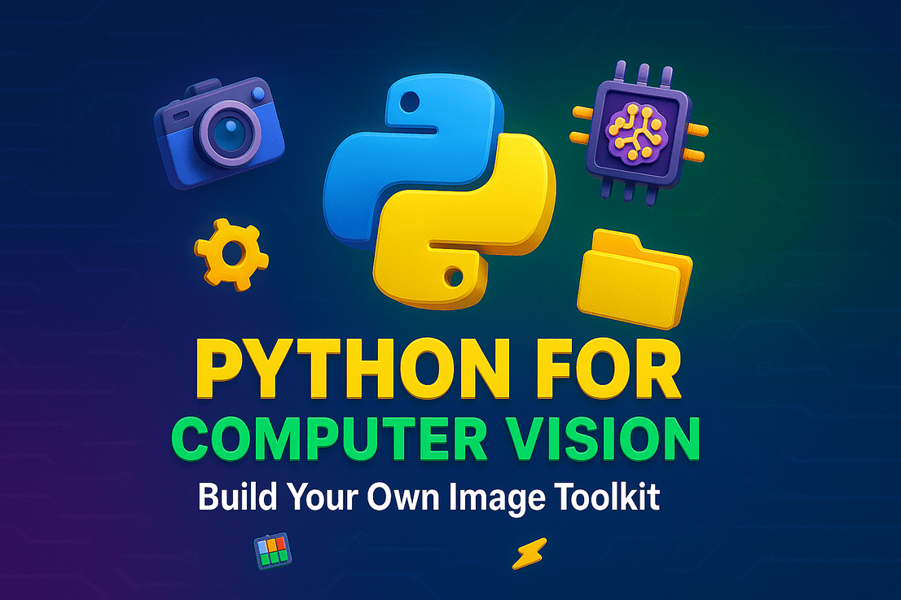

# 🧠 Python for Computer Vision: Build Your Own Image Toolkit from Scratch

A hands-on course where you'll learn how to **build your own image processing toolkit in Python**, tailored for **real-world computer vision tasks**. From loading images to simulating defects and preparing datasets for deep learning — this course gives you the tools to do it all (and ship your own CLI tool at the end!).

</a>

## ✅ What You'll Learn

- 🔍 Python & Computer Vision Fundamentals
- 📁 Dataset Management & Organization
- 🖼️ Image Preprocessing & Manipulation
- 🧮 Essential CV Algorithms
- 🔄 Advanced Computer Vision Techniques
- 🎭 Data Augmentation & Simulation
- 📊 Analysis & Validation
- ⚡ Performance Optimization
- 🔧 Tools & Integration

## 🚀 By the End, You'll Have:
A fully working `cv_toolkit.py` script that lets you run commands like:
```bash
python cv_toolkit.py --input ./raw --resize 256x256 --grayscale --add_scratches --output ./processed
```

## 💡 Perfect For:
- 🔍 Complete beginners to programming
- 🤖 Python developers new to CV
- 🛠️ Anyone building personal or production-level vision projects

---

## 📚 Course Structure

### PART 1: FOUNDATIONS (For Complete Beginners)

#### 📁 Section 1: Introduction to Programming & Computer Vision
*Videos 1-7*

| Video | Title                                                                   |
| ----- | ----------------------------------------------------------------------- |
| 1     | 📦 Introduction    [🎥 Watch Video](https://youtu.be/tAumg8Odcm4) | [💻 Code Example](No)     |
| 2     | 📦 What is Computer Vision & Why Python? + Real-World Use Cases    [🎥 Watch Video](https://youtu.be/trL2qIfpY3U) | [💻 Code Example](No)     |
| 3     | 🛠️ Installing Python & Tools You Need – With Common Pitfalls & Fixes [🎥 Watch Video](https://youtu.be/ocVk_B-ivHQ) | [💻 Code Example](No)   |
| 4     | 🎵 Modern Dependency Management with Poetry [🎥 Watch Video](https://youtu.be/F5sdNXb2P98) | [💻 Code Example]("No")|
| 5     | 🔍 Code Quality with Pre-commit Hooks [🎥 Watch Video](https://youtu.be/yLKmW7zjTwM)                                  |
| 6     | 🧪 Running Your First Image Script – "Hello World" for CV  [🎥 Watch Video](https://youtu.be/JUHTCel4U4E  )            |
| 7     | 🧭 Course Roadmap – How to Get the Most Out of This Playlist            |

---

#### 📁 Section 2: Python Fundamentals Through Image Examples
*Videos 8-14*

| Video | Title                                                          | Code Example                                      |
| ----- | -------------------------------------------------------------- | ------------------------------------------------- |
| 8     | 🔢 Variables, Numbers & Strings [🎥 Watch Video](https://youtu.be/2cp5OEHMoNQ) | [💻 Code Example](Sec2_Core_Python_CV/Variables_Numbers_Strings_CV.ipynb) |
| 9     | ➡️ If Statements & Loops      [🎥 Watch Video](https://youtu.be/HpEgJsQHFWY) | [💻 Code Example](Sec2_Core_Python_CV/IF_LOOP.ipynb) |
| 10.1    | 📋 Lists[🎥 Watch Video](https://youtu.be/svcXGLx7PIY) | [💻 Code Example](Sec2_Core_Python_CV/lists.ipynb) |
| 10.2    | 📋 Tuple[🎥 Watch Video](https://youtu.be/u45nm0G2Wbg) | [💻 Code Example](Sec2_Core_Python_CV/tuples_notebook.ipynb) |
| 10.3    | 📋 Dictionaries[🎥 Watch Video](https://youtu.be/HpEgJsQHFWY) | [💻 Code Example](Sec2_Core_Python_CV/dictionaries_notebook.ipynb) |
| 11    | 🔁 Functions[🎥 Watch Video](https://youtu.be/zGBIQAHH168) | [💻 Code Example](Sec2_Core_Python_CV/functions_notebook.ipynb) |
| 12    | 🔄 Working with Files & Directories [🎥 Watch Video](https://youtu.be/SX7hklop9gg) | [💻 Code Example](Sec2_Core_Python_CV/Files_DIR_%20Tutorial.ipynb) |
| 13    | ⚠️ Error Handling & Debugging [🎥 Watch Video](https://youtu.be/C6vlF4-xXm4)| [💻 Code Example](Sec2_Core_Python_CV/Error_handling.ipynb) |
|14 |📊 🧪 Quiz Time: Test Your Python Knowledge So [🎥 Watch Video]| [💻 Code Example]


---

#### 📁 Section 3: First Steps with Images
*New section combining basics*

| Video | Title                                                          | Code Example                                      |
| ----- | -------------------------------------------------------------- | ------------------------------------------------- |
| 15    | 📷 How Computers See Images - Pixels, RGB, Channels [🎥 Watch Video](https://youtu.be/mkel9UVOWSw)| [💻 Code Example] |
| 16    | 📥 Load & Show Images Using OpenCV & Pillow [🎥 Watch Video](https://youtu.be/a9ITIB2TFoI) | [💻 Code Example](Sec3_Working_with_Images/OpenCV_PILLOW.ipynb) |
| 17    | 📐 Basic Transformations: Resize, Crop, Rotate      [🎥 Watch Video](https://youtu.be/tOqTAG3i2_o) | [💻 Code Example](Sec3_Working_with_Images/OpenCV_PILLOW_Advance.ipynb) |
| 18    | 🌈 Understanding Color Spaces                       [🎥 Watch Video](https://youtu.be/HLSIKaqfyKs)| [💻 Code Example](Sec3_Working_with_Images/color_spaces_tutorial.ipynb) |
| 19    | 📸 Mini Project: Simple Image Processing            [🎥 Watch Video(https://youtu.be/TaQH8pXRzTw)]| [💻 Code Example](Sec3_Working_with_Images/sec3_project.py) |

### PART 2: BUILDING BLOCKS

#### 📁 Section 4: Object-Oriented Programming for CV
*Videos 20-29*

| Video | Title                                                                      | Code Example                                      |
| ----- | -------------------------------------------------------------------------- | ------------------------------------------------- |
| 20    | 🚪 What is OOP? Why It Matters for Computer Vision                         [🎥 Watch Video](https://youtu.be/KMQqxsimMBU)|  |
| 21    | 📦 Classes vs Functions – When to Use Which                                [🎥 Watch Video]| [💻 Code Example](Sec4_OOP_in_CV/02_classes_vs_functions.ipynb) |
| 22    | 🛠️ Defining Your First Class                            [🎥 Watch Video](https://youtu.be/kI_JrnydPzI)| [💻 Code Example](Sec4_OOP_in_CV/python_classes.ipynb) |
| 23    | 🧱 Attributes & Methods – Organizing Image Transformations[🎥 Watch Video](https://youtu.be/kI_JrnydPzI)| [💻 Code Example](Sec4_OOP_in_CV/python_classes.ipynb) |
| 24    | 🗝️ Constructors (`__init__`) and Default Settings[🎥 Watch Video](https://youtu.be/kI_JrnydPzI)| [💻 Code Example](Sec4_OOP_in_CV/python_classes.ipynb) |
| 25    | 🎯 Mini Project: Build an Image Processor with Load–Transform–Save Methods [🎥 Watch Video]| [💻 Code Example] |

#### 📁 Section 4A: Advanced Pythonic OOP
*Videos 26-36*

| Video | Title                                                                      | Code Example                                      |
| ----- | -------------------------------------------------------------------------- | ------------------------------------------------- |
| 25    | 🔁 Inheritance – Build Specialized Processors from Base Classes            [🎥 Watch Video]| [💻 Code Example] |
| 27    | 🧙 Magic Methods (Dunder) – Customize Behavior with `__str__`, `__add__`, `__eq__`, etc. |                                     |
| 28    | 🎁 Data Classes – Say Goodbye to Boilerplate with `@dataclass`             [🎥 Watch Video]| [💻 Code Example] |
| 29    | 🧭 Class vs Static vs Instance Methods – When and Why to Use Each          [🎥 Watch Video]| [💻 Code Example] |
| 30    | 🔐 Encapsulation & Property Decorators – Clean Access with `@property` and Getters/Setters |                                   |
| 31    | 🌀 Polymorphism – Use One Interface with Many Implementations              [🎥 Watch Video]| [💻 Code Example] |
| 32    | 🧱 Abstract Base Classes – Enforce Rules Using `abc.ABC` and `@abstractmethod` |                                               |
| 33    | 🧰 Composition Over Inheritance – "Has-a" Relationships for Real-World Modeling |                                              |
| 34    | 💼 Build a Professional-Grade `ImagePipeline` Class                        [🎥 Watch Video]| [💻 Code Example] |
| 35    | 🔄 OOP Design Patterns for Computer Vision Applications                    [🎥 Watch Video]| [💻 Code Example] |
| 36    | 📝 Mini Project: Complete OOP-Based Image Processing Library               [🎥 Watch Video]| [💻 Code Example] |

#### 📁 Section 5: Working with Image Files & Folders
*Videos 37-43*

| Video | Title                                                          | Code Example                                      |
| ----- | -------------------------------------------------------------- | ------------------------------------------------- |
| 37    | 🗂️ Organizing Your Dataset - Folder Structures       [🎥 Watch Video]| [💻 Code Example] |
| 38    | 📁 List All Images in a Folder Recursively           [🎥 Watch Video]| [💻 Code Example] |
| 39    | 🔄 Rename, Move & Copy Files Like a Pro              [🎥 Watch Video]| [💻 Code Example] |
| 40    | ❌ Delete Unwanted Files Safely                      [🎥 Watch Video]| [💻 Code Example] |
| 41    | 🖼️ Convert Image Formats in Bulk                    [🎥 Watch Video]| [💻 Code Example] |
| 42    | 🔄 Version Control for Image Datasets                [🎥 Watch Video]| [💻 Code Example] |
| 43    | 📁 Mini Project: Organize Dataset into Splits        [🎥 Watch Video]| [💻 Code Example] |

#### 📁 Section 6: Essential Image Preprocessing
*Videos 44-49*

| Video | Title                                                          | Code Example                                      |
| ----- | -------------------------------------------------------------- | ------------------------------------------------- |
| 44    | 📦 Patchify Large Images into Tiles                  [🎥 Watch Video]| [💻 Code Example] |
| 45    | ✂️ Crop Images to Region of Interest                 [🎥 Watch Video]| [💻 Code Example] |
| 46    | 🎨 Histogram Equalization for Better Contrast        [🎥 Watch Video]| [💻 Code Example] |
| 47    | 🖌️ Overlay Masks on Images for Segmentation         [🎥 Watch Video]| [💻 Code Example] |
| 48    | 🔀 Normalize Pixel Values for Deep Learning          [🎥 Watch Video]| [💻 Code Example] |
| 49    | 🧰 Mini Project: Complete Preprocessing Pipeline     [🎥 Watch Video]| [💻 Code Example] |

### PART 3: CORE CV TECHNIQUES

#### 📁 Section 7: Image Filtering & Edge Detection
*Videos 50-56*

| Video | Title                                                          | Code Example                                      |
| ----- | -------------------------------------------------------------- | ------------------------------------------------- |
| 50    | 🔍 Introduction to Image Filtering & Kernels         [🎥 Watch Video]| [💻 Code Example] |
| 51    | 🔪 Edge Detection: Sobel, Canny, and Laplacian       [🎥 Watch Video]| [💻 Code Example] |
| 52    | 🧮 Convolution: How Filters Work Under the Hood      [🎥 Watch Video]| [💻 Code Example] |
| 53    | 🎯 Corner Detection: Harris & Shi-Tomasi Methods     [🎥 Watch Video]| [💻 Code Example] |
| 54    | 🧿 Blob Detection Using Laplacian of Gaussian        [🎥 Watch Video]| [💻 Code Example] |
| 55    | 🌀 Advanced Filtering for Denoising                  [🎥 Watch Video]| [💻 Code Example] |
| 56    | 🎭 Mini Project: Edge Detection Visualization Tool   [🎥 Watch Video]| [💻 Code Example] |

#### 📁 Section 8: Feature Detection & Matching
*Videos 57-62*

| Video | Title                                                          | Code Example                                      |
| ----- | -------------------------------------------------------------- | ------------------------------------------------- |
| 57    | 🔑 Local Features: SIFT, SURF, ORB, and BRIEF        [🎥 Watch Video]| [💻 Code Example] |
| 58    | 🔄 Feature Matching Techniques & Distance Metrics    [🎥 Watch Video]| [💻 Code Example] |
| 59    | 🖼️ Image Matching with RANSAC                       [🎥 Watch Video]| [💻 Code Example] |
| 60    | 🧩 Creating Image Mosaics with Homography            [🎥 Watch Video]| [💻 Code Example] |
| 61    | 🗝️ Building a Simple Object Recognition System      [🎥 Watch Video]| [💻 Code Example] |
| 62    | 🔍 Mini Project: Image Matching Application          [🎥 Watch Video]| [💻 Code Example] |

#### 📁 Section 9: Data Augmentation & Defect Simulation
*Videos 63-68*

| Video | Title                                                          | Code Example                                      |
| ----- | -------------------------------------------------------------- | ------------------------------------------------- |
| 63    | 🌫️ Add Artificial Noise & Blur to Images            [🎥 Watch Video]| [💻 Code Example] |
| 64    | 📏 Draw Random Lines & Scratches                     [🎥 Watch Video]| [💻 Code Example] |
| 65    | 🌒 Simulate Occlusion & Lighting Changes             [🎥 Watch Video]| [💻 Code Example] |
| 66    | 🔄 Rotate Images for Robustness                      [🎥 Watch Video]| [💻 Code Example] |
| 67    | 🎞️ Apply Transformations in Real-Time               [🎥 Watch Video]| [💻 Code Example] |
| 68    | 🧨 Mini Project: Realistic Defect Simulation         [🎥 Watch Video]| [💻 Code Example] |

### PART 4: ADVANCED TECHNIQUES

#### 📁 Section 10: Segmentation & Shape Analysis
*Videos 69-74*

| Video | Title                                                          | Code Example                                      |
| ----- | -------------------------------------------------------------- | ------------------------------------------------- |
| 69    | 🧩 Thresholding Techniques                           [🎥 Watch Video]| [💻 Code Example] |
| 70    | 🔍 Connected Component Analysis & Region Properties  [🎥 Watch Video]| [💻 Code Example] |
| 71    | 📊 Watershed Algorithm for Complex Segmentation      [🎥 Watch Video]| [💻 Code Example] |
| 72    | ➰ Contour Detection & Manipulation                  [🎥 Watch Video]| [💻 Code Example] |
| 73    | 📝 Shape Analysis: Moments, Circularity, Convexity   [🎥 Watch Video]| [💻 Code Example] |
| 74    | 🔍 Mini Project: Shape Classifier                    [🎥 Watch Video]| [💻 Code Example] |

#### 📁 Section 11: Motion Analysis & Video Processing
*Videos 75-79*

| Video | Title                                                          | Code Example                                      |
| ----- | -------------------------------------------------------------- | ------------------------------------------------- |
| 75    | 🌊 Optical Flow: Lucas-Kanade Method                 [🎥 Watch Video]| [💻 Code Example] |
| 76    | 🔄 Dense Optical Flow for Motion Field Estimation    [🎥 Watch Video]| [💻 Code Example] |
| 77    | 🎯 Object Tracking Algorithms                        [🎥 Watch Video]| [💻 Code Example] |
| 78    | 🔍 Background Subtraction for Moving Object Detection[🎥 Watch Video]| [💻 Code Example] |
| 79    | 🏃 Mini Project: Motion Heatmap Generator            [🎥 Watch Video]| [💻 Code Example] |

#### 📁 Section 12: Working with Masks & Annotations
*Videos 80-87*

| Video | Title                                                          | Code Example                                      |
| ----- | -------------------------------------------------------------- | ------------------------------------------------- |
| 80    | 🎭 What Are Binary Masks & Why They Matter           [🎥 Watch Video]| [💻 Code Example] |
| 81    | 📐 Generate Masks from Bounding Box Annotations      [🎥 Watch Video]| [💻 Code Example] |
| 82    | 🎨 Create Synthetic Masks for Objects                [🎥 Watch Video]| [💻 Code Example] |
| 83    | 👀 Visualize Image-Mask Pairs                        [🎥 Watch Video]| [💻 Code Example] |
| 84    | 📄 Edit Items in JSON Annotation Files               [🎥 Watch Video]| [💻 Code Example] |
| 85    | 🔍 Filter Annotations by Class                       [🎥 Watch Video]| [💻 Code Example] |
| 86    | ⚠️ Check for Missing Images or Labels                [🎥 Watch Video]| [💻 Code Example] |
| 87    | 🧪 Mini Project: Annotation File Manipulation Tool   [🎥 Watch Video]| [💻 Code Example] |

### PART 5: OPTIMIZATION & INTEGRATION

#### 📁 Section 13: Dataset Analysis & Quality Control
*Videos 88-92*

| Video | Title                                                          | Code Example                                      |
| ----- | -------------------------------------------------------------- | ------------------------------------------------- |
| 88    | 📊 Analyze Image Dimensions Across Dataset           [🎥 Watch Video]| [💻 Code Example] |
| 89    | 📈 Plot Class Distribution from Annotations          [🎥 Watch Video]| [💻 Code Example] |
| 90    | 🔍 Show Random Samples from Dataset                  [🎥 Watch Video]| [💻 Code Example] |
| 91    | 🗂️ Detect Duplicate Images Automatically            [🎥 Watch Video]| [💻 Code Example] |
| 92    | 📊 Mini Project: Interactive Dataset Analysis Dashboard [🎥 Watch Video]| [💻 Code Example] |

#### 📁 Section 14: Performance Optimization
*Videos 93-97*

| Video | Title                                                          | Code Example                                      |
| ----- | -------------------------------------------------------------- | ------------------------------------------------- |
| 93    | ⚡ Speed Up Processing with Multiprocessing           [🎥 Watch Video]| [💻 Code Example] |
| 94    | 🔢 Vectorization Techniques with NumPy               [🎥 Watch Video]| [💻 Code Example] |
| 95    | 🚀 GPU Acceleration for Image Processing             [🎥 Watch Video]| [💻 Code Example] |
| 96    | 💾 Memory Management for Large Datasets              [🎥 Watch Video]| [💻 Code Example] |
| 97    | ⏱️ Mini Project: Optimized Preprocessing Pipeline    [🎥 Watch Video]| [💻 Code Example] |

#### 📁 Section 15: Bridging to Deep Learning
*Videos 98-102*

| Video | Title                                                          | Code Example                                      |
| ----- | -------------------------------------------------------------- | ------------------------------------------------- |
| 98    | 🔄 When to Use Traditional CV vs. Deep Learning      [🎥 Watch Video]| [💻 Code Example] |
| 99    | 🧠 Feature Engineering for Neural Networks           [🎥 Watch Video]| [💻 Code Example] |
| 100   | 🎯 Improving CNN Performance with Preprocessing      [🎥 Watch Video]| [💻 Code Example] |
| 101   | 📈 Hybrid Systems: CV + Neural Networks              [🎥 Watch Video]| [💻 Code Example] |
| 102   | 🔍 Mini Project: Hybrid Object Detection System      [🎥 Watch Video]| [💻 Code Example] |

### PART 6: ADVANCED APPLICATIONS & FINAL PROJECT

#### 📁 Section 16: Anomaly Detection with PaDiM
*Videos 103-107*

| Video | Title                                                          | Code Example                                      |
| ----- | -------------------------------------------------------------- | ------------------------------------------------- |
| 103   | 🔍 Introduction to PaDiM Algorithm                   [🎥 Watch Video]| [💻 Code Example] |
| 104   | 🛠️ Implementation Details & Step-by-Step Guide      [🎥 Watch Video]| [💻 Code Example] |
| 105   | ⚙️ Parameter Optimization for Specific Use Cases     [🎥 Watch Video]| [💻 Code Example] |
| 106   | 📊 Performance Evaluation and Visualization          [🎥 Watch Video]| [💻 Code Example] |
| 107   | 🧪 Mini Project: PaDiM-Based Defect Detector         [🎥 Watch Video]| [💻 Code Example] |

#### 📁 Section 17: Model Validation & Testing
*Videos 108-111*

| Video | Title                                                          | Code Example                                      |
| ----- | -------------------------------------------------------------- | ------------------------------------------------- |
| 108   | 📏 Evaluation Metrics for Computer Vision Models     [🎥 Watch Video]| [💻 Code Example] |
| 109   | 🧪 Test Dataset Preparation and Validation           [🎥 Watch Video]| [💻 Code Example] |
| 110   | 📊 Result Visualization and Interpretation           [🎥 Watch Video]| [💻 Code Example] |
| 111   | 📝 Mini Project: Automated Validation Pipeline       [🎥 Watch Video]| [💻 Code Example] |

#### 📁 Section 18: Building the Complete CV Toolkit
*Videos 112-115*

| Video | Title                                                          | Code Example                                      |
| ----- | -------------------------------------------------------------- | ------------------------------------------------- |
| 112   | 🏗️ Architecture Design for the CLI Toolkit          [🎥 Watch Video]| [💻 Code Example] |
| 113   | 🧩 Component Integration with Modular Approach       [🎥 Watch Video]| [💻 Code Example] |
| 114   | 💻 Command-line Interface Implementation             [🎥 Watch Video]| [💻 Code Example] |
| 115   | 📚 Mini Project: Complete CV Toolkit                 [🎥 Watch Video]| [💻 Code Example] |

#### 📁 Section 19: Next Steps & Advanced Topics
*Videos 116-118*

| Video | Title                                                |
| ----- | ---------------------------------------------------- |
| 116   | 🔭 Advanced Computer Vision Topics                   |
| 117   | 🏢 Industry Application Case Studies                 |
| 118   | 🛣️ Career Paths & Resources for Continued Learning  |

## ✅ Summary

This course provides a comprehensive learning path from basic programming concepts to advanced computer vision techniques. With a strong emphasis on visual learning, hands-on practice, and real-world applications, you'll build a complete image processing toolkit while gaining valuable skills applicable to various computer vision projects.

Each section includes a mini-project that applies the concepts learned, building progressively toward the final CLI toolkit. The course is designed to be accessible to complete beginners while providing depth for those with prior programming experience.
